```python
import pandas as pd
import numpy as np
import seaborn as sns
sns.set_theme(style = 'whitegrid')
current_palette = sns.color_palette("Paired")
sns.set_palette(current_palette)
import plotly.express as px

import matplotlib.pyplot as plt
```


```python
vehicle_df = pd.read_csv('/Users/priti16/Downloads/assignment_5_1_starter/data/coupons.csv')
```


```python
vehicle_df.head()
```


<div>
<style scoped>
    .dataframe tbody tr th:only-of-type {
        vertical-align: middle;
    }

    .dataframe tbody tr th {
        vertical-align: top;
    }

    .dataframe thead th {
        text-align: right;
    }
</style>
<table border="1" class="dataframe">
  <thead>
    <tr style="text-align: right;">
      <th></th>
      <th>destination</th>
      <th>passanger</th>
      <th>weather</th>
      <th>temperature</th>
      <th>time</th>
      <th>coupon</th>
      <th>expiration</th>
      <th>gender</th>
      <th>age</th>
      <th>maritalStatus</th>
      <th>...</th>
      <th>CoffeeHouse</th>
      <th>CarryAway</th>
      <th>RestaurantLessThan20</th>
      <th>Restaurant20To50</th>
      <th>toCoupon_GEQ5min</th>
      <th>toCoupon_GEQ15min</th>
      <th>toCoupon_GEQ25min</th>
      <th>direction_same</th>
      <th>direction_opp</th>
      <th>Y</th>
    </tr>
  </thead>
  <tbody>
    <tr>
      <th>0</th>
      <td>No Urgent Place</td>
      <td>Alone</td>
      <td>Sunny</td>
      <td>55</td>
      <td>2PM</td>
      <td>Restaurant(&lt;20)</td>
      <td>1d</td>
      <td>Female</td>
      <td>21</td>
      <td>Unmarried partner</td>
      <td>...</td>
      <td>never</td>
      <td>NaN</td>
      <td>4~8</td>
      <td>1~3</td>
      <td>1</td>
      <td>0</td>
      <td>0</td>
      <td>0</td>
      <td>1</td>
      <td>1</td>
    </tr>
    <tr>
      <th>1</th>
      <td>No Urgent Place</td>
      <td>Friend(s)</td>
      <td>Sunny</td>
      <td>80</td>
      <td>10AM</td>
      <td>Coffee House</td>
      <td>2h</td>
      <td>Female</td>
      <td>21</td>
      <td>Unmarried partner</td>
      <td>...</td>
      <td>never</td>
      <td>NaN</td>
      <td>4~8</td>
      <td>1~3</td>
      <td>1</td>
      <td>0</td>
      <td>0</td>
      <td>0</td>
      <td>1</td>
      <td>0</td>
    </tr>
    <tr>
      <th>2</th>
      <td>No Urgent Place</td>
      <td>Friend(s)</td>
      <td>Sunny</td>
      <td>80</td>
      <td>10AM</td>
      <td>Carry out &amp; Take away</td>
      <td>2h</td>
      <td>Female</td>
      <td>21</td>
      <td>Unmarried partner</td>
      <td>...</td>
      <td>never</td>
      <td>NaN</td>
      <td>4~8</td>
      <td>1~3</td>
      <td>1</td>
      <td>1</td>
      <td>0</td>
      <td>0</td>
      <td>1</td>
      <td>1</td>
    </tr>
    <tr>
      <th>3</th>
      <td>No Urgent Place</td>
      <td>Friend(s)</td>
      <td>Sunny</td>
      <td>80</td>
      <td>2PM</td>
      <td>Coffee House</td>
      <td>2h</td>
      <td>Female</td>
      <td>21</td>
      <td>Unmarried partner</td>
      <td>...</td>
      <td>never</td>
      <td>NaN</td>
      <td>4~8</td>
      <td>1~3</td>
      <td>1</td>
      <td>1</td>
      <td>0</td>
      <td>0</td>
      <td>1</td>
      <td>0</td>
    </tr>
    <tr>
      <th>4</th>
      <td>No Urgent Place</td>
      <td>Friend(s)</td>
      <td>Sunny</td>
      <td>80</td>
      <td>2PM</td>
      <td>Coffee House</td>
      <td>1d</td>
      <td>Female</td>
      <td>21</td>
      <td>Unmarried partner</td>
      <td>...</td>
      <td>never</td>
      <td>NaN</td>
      <td>4~8</td>
      <td>1~3</td>
      <td>1</td>
      <td>1</td>
      <td>0</td>
      <td>0</td>
      <td>1</td>
      <td>0</td>
    </tr>
  </tbody>
</table>
<p>5 rows × 26 columns</p>
</div>


```python
vehicle_df.info()
```

    <class 'pandas.core.frame.DataFrame'>
    RangeIndex: 12684 entries, 0 to 12683
    Data columns (total 26 columns):
     #   Column                Non-Null Count  Dtype 
    ---  ------                --------------  ----- 
     0   destination           12684 non-null  object
     1   passanger             12684 non-null  object
     2   weather               12684 non-null  object
     3   temperature           12684 non-null  int64 
     4   time                  12684 non-null  object
     5   coupon                12684 non-null  object
     6   expiration            12684 non-null  object
     7   gender                12684 non-null  object
     8   age                   12684 non-null  object
     9   maritalStatus         12684 non-null  object
     10  has_children          12684 non-null  int64 
     11  education             12684 non-null  object
     12  occupation            12684 non-null  object
     13  income                12684 non-null  object
     14  car                   108 non-null    object
     15  Bar                   12577 non-null  object
     16  CoffeeHouse           12467 non-null  object
     17  CarryAway             12533 non-null  object
     18  RestaurantLessThan20  12554 non-null  object
     19  Restaurant20To50      12495 non-null  object
     20  toCoupon_GEQ5min      12684 non-null  int64 
     21  toCoupon_GEQ15min     12684 non-null  int64 
     22  toCoupon_GEQ25min     12684 non-null  int64 
     23  direction_same        12684 non-null  int64 
     24  direction_opp         12684 non-null  int64 
     25  Y                     12684 non-null  int64 
    dtypes: int64(8), object(18)
    memory usage: 2.5+ MB


```python
vehicle_df.isnull().sum()
```


    destination                 0
    passanger                   0
    weather                     0
    temperature                 0
    time                        0
    coupon                      0
    expiration                  0
    gender                      0
    age                         0
    maritalStatus               0
    has_children                0
    education                   0
    occupation                  0
    income                      0
    car                     12576
    Bar                       107
    CoffeeHouse               217
    CarryAway                 151
    RestaurantLessThan20      130
    Restaurant20To50          189
    toCoupon_GEQ5min            0
    toCoupon_GEQ15min           0
    toCoupon_GEQ25min           0
    direction_same              0
    direction_opp               0
    Y                           0
    dtype: int64


```python
vehicle_df['car'].unique()
```


    array([nan, 'Scooter and motorcycle', 'crossover', 'Mazda5',
           'do not drive', 'Car that is too old to install Onstar :D'],
          dtype=object)


```python
vehicle_df.drop(columns=['car'], inplace=True)
```


```python

values = {'col':[],'unique':[]}

for col in vehicle_df.columns:
    values['col'].append(col)
    values['unique'].append(vehicle_df[col].unique())

values = pd.DataFrame(values)

values
```


<div>
<style scoped>
    .dataframe tbody tr th:only-of-type {
        vertical-align: middle;
    }

    .dataframe tbody tr th {
        vertical-align: top;
    }

    .dataframe thead th {
        text-align: right;
    }
</style>
<table border="1" class="dataframe">
  <thead>
    <tr style="text-align: right;">
      <th></th>
      <th>col</th>
      <th>unique</th>
    </tr>
  </thead>
  <tbody>
    <tr>
      <th>0</th>
      <td>destination</td>
      <td>[No Urgent Place, Home, Work]</td>
    </tr>
    <tr>
      <th>1</th>
      <td>passanger</td>
      <td>[Alone, Friend(s), Kid(s), Partner]</td>
    </tr>
    <tr>
      <th>2</th>
      <td>weather</td>
      <td>[Sunny, Rainy, Snowy]</td>
    </tr>
    <tr>
      <th>3</th>
      <td>temperature</td>
      <td>[55, 80, 30]</td>
    </tr>
    <tr>
      <th>4</th>
      <td>time</td>
      <td>[2PM, 10AM, 6PM, 7AM, 10PM]</td>
    </tr>
    <tr>
      <th>5</th>
      <td>coupon</td>
      <td>[Restaurant(&lt;20), Coffee House, Carry out &amp; Ta...</td>
    </tr>
    <tr>
      <th>6</th>
      <td>expiration</td>
      <td>[1d, 2h]</td>
    </tr>
    <tr>
      <th>7</th>
      <td>gender</td>
      <td>[Female, Male]</td>
    </tr>
    <tr>
      <th>8</th>
      <td>age</td>
      <td>[21, 46, 26, 31, 41, 50plus, 36, below21]</td>
    </tr>
    <tr>
      <th>9</th>
      <td>maritalStatus</td>
      <td>[Unmarried partner, Single, Married partner, D...</td>
    </tr>
    <tr>
      <th>10</th>
      <td>has_children</td>
      <td>[1, 0]</td>
    </tr>
    <tr>
      <th>11</th>
      <td>education</td>
      <td>[Some college - no degree, Bachelors degree, A...</td>
    </tr>
    <tr>
      <th>12</th>
      <td>occupation</td>
      <td>[Unemployed, Architecture &amp; Engineering, Stude...</td>
    </tr>
    <tr>
      <th>13</th>
      <td>income</td>
      <td>[$37500 - $49999, $62500 - $74999, $12500 - $2...</td>
    </tr>
    <tr>
      <th>14</th>
      <td>Bar</td>
      <td>[never, less1, 1~3, gt8, nan, 4~8]</td>
    </tr>
    <tr>
      <th>15</th>
      <td>CoffeeHouse</td>
      <td>[never, less1, 4~8, 1~3, gt8, nan]</td>
    </tr>
    <tr>
      <th>16</th>
      <td>CarryAway</td>
      <td>[nan, 4~8, 1~3, gt8, less1, never]</td>
    </tr>
    <tr>
      <th>17</th>
      <td>RestaurantLessThan20</td>
      <td>[4~8, 1~3, less1, gt8, nan, never]</td>
    </tr>
    <tr>
      <th>18</th>
      <td>Restaurant20To50</td>
      <td>[1~3, less1, never, gt8, 4~8, nan]</td>
    </tr>
    <tr>
      <th>19</th>
      <td>toCoupon_GEQ5min</td>
      <td>[1]</td>
    </tr>
    <tr>
      <th>20</th>
      <td>toCoupon_GEQ15min</td>
      <td>[0, 1]</td>
    </tr>
    <tr>
      <th>21</th>
      <td>toCoupon_GEQ25min</td>
      <td>[0, 1]</td>
    </tr>
    <tr>
      <th>22</th>
      <td>direction_same</td>
      <td>[0, 1]</td>
    </tr>
    <tr>
      <th>23</th>
      <td>direction_opp</td>
      <td>[1, 0]</td>
    </tr>
    <tr>
      <th>24</th>
      <td>Y</td>
      <td>[1, 0]</td>
    </tr>
  </tbody>
</table>
</div>


```python
# Drop column since there is only one unique value
vehicle_df.drop(columns=['toCoupon_GEQ5min'], inplace=True)
     
```


```python
vehicle_df.rename(columns={'passanger': 'passenger', 'maritalStatus': 'marital_status', 'CarryAway': 'CarryOut', 'Y': 'target'}, inplace = True)
     
```


```python
vehicle_df.target.value_counts().plot(kind='bar')
plt.title('Target Class')
```


    Text(0.5, 1.0, 'Target Class')


    
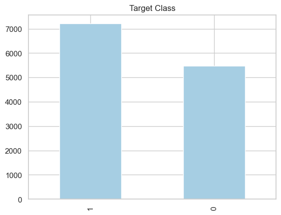
    


```python
# Drop column, redundant
vehicle_df.drop(columns=['direction_opp'], inplace=True)
```


```python
sns.countplot(x='Bar',data=vehicle_df,hue='target')
plt.title("Bar Value Counts")
```


    Text(0.5, 1.0, 'Bar Value Counts')


    
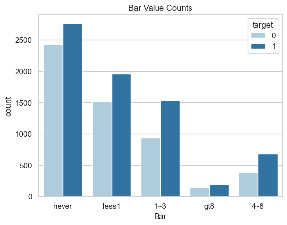
    


```python
sns.countplot(x='CoffeeHouse',data=vehicle_df,hue='target')
plt.title("CoffeeHouse Value Counts")
```


    Text(0.5, 1.0, 'CoffeeHouse Value Counts')


    
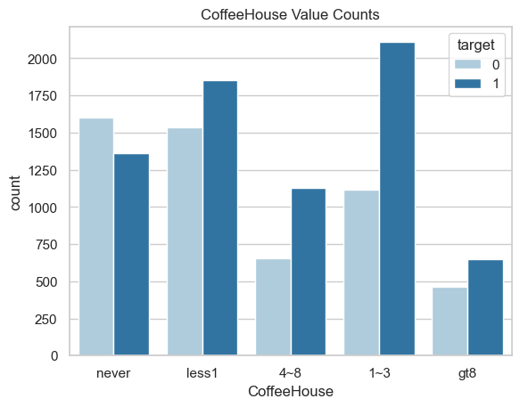
    


```python
sns.countplot(x='CarryOut',data=vehicle_df,hue='target')
plt.title("CarryOut Value Counts")
```


    Text(0.5, 1.0, 'CarryOut Value Counts')


    
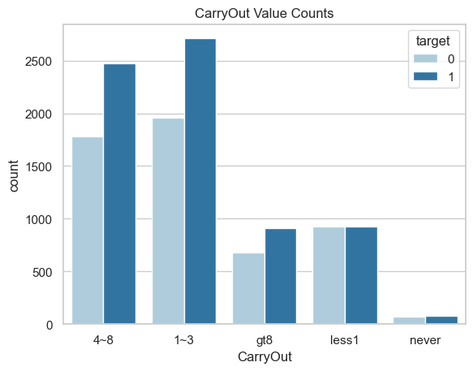
    


```python
vehicle_df['education'].unique()
```


    array(['Some college - no degree', 'Bachelors degree',
           'Associates degree', 'High School Graduate',
           'Graduate degree (Masters or Doctorate)', 'Some High School'],
          dtype=object)


```python
plt.figure(figsize=(8,6))

vehicle_df.occupation.value_counts().plot(kind='bar')
plt.title('Occupation Values Count')
     
```


    Text(0.5, 1.0, 'Occupation Values Count')


    
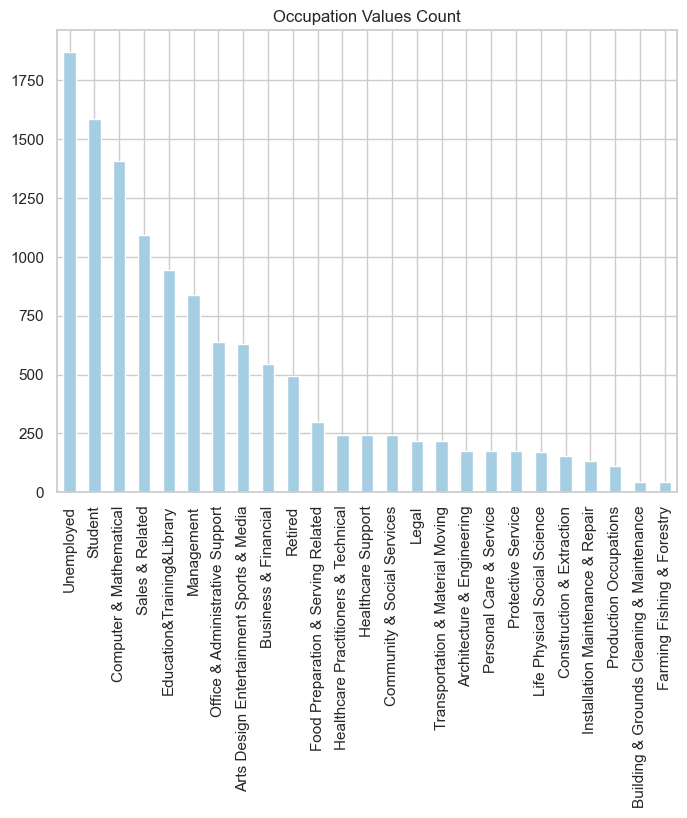
    


```python
target_yes = vehicle_df[vehicle_df['target']==1] 
target_no = vehicle_df[vehicle_df['target']==0] 
```


```python
plt.figure(figsize=(8,6))
sns.lineplot(y=target_yes['occupation'].value_counts().to_dict().keys(),x=target_yes['occupation'].value_counts().to_dict().values())

plt.title('Coupon used by Occupation')
```


    Text(0.5, 1.0, 'Coupon used by Occupation')


    
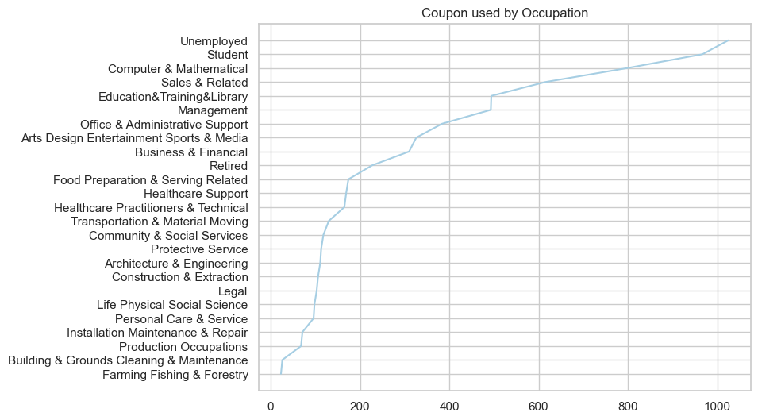
    


```python
plt.figure(figsize=(8,6))

vehicle_df.education.value_counts().plot(kind='bar')
plt.title('Education Values Count')
```


    Text(0.5, 1.0, 'Education Values Count')


    
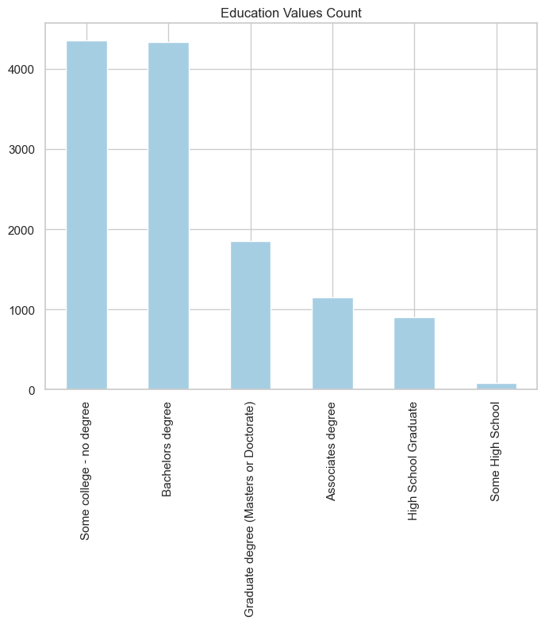
    


```python
plt.figure(figsize=(8,6))
sns.lineplot(y=target_yes['education'].value_counts().to_dict().keys(),x=target_yes['education'].value_counts().to_dict().values())

plt.title('Coupon used by Education')
```


    Text(0.5, 1.0, 'Coupon used by Education')


    
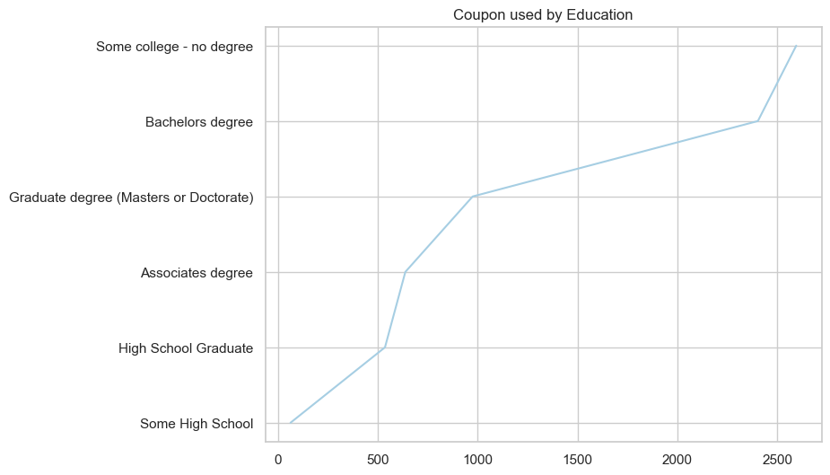
    


```python
plt.figure(figsize=(8,6))

vehicle_df.age.value_counts().plot(kind='bar')
plt.title('Age Values Count')
```


    Text(0.5, 1.0, 'Age Values Count')


    
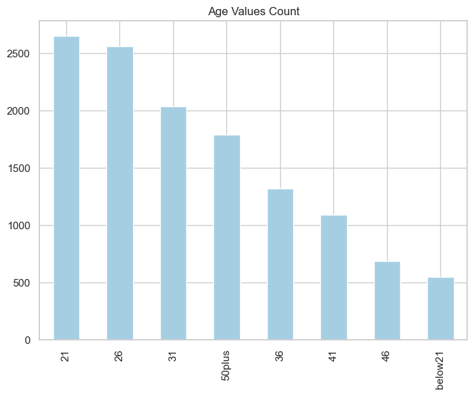
    


```python
plt.figure(figsize=(8,6))
sns.lineplot(y=target_yes['age'].value_counts().to_dict().keys(),x=target_yes['age'].value_counts().to_dict().values())

plt.title('Coupon used by Age')
     
```


    Text(0.5, 1.0, 'Coupon used by Age')


    
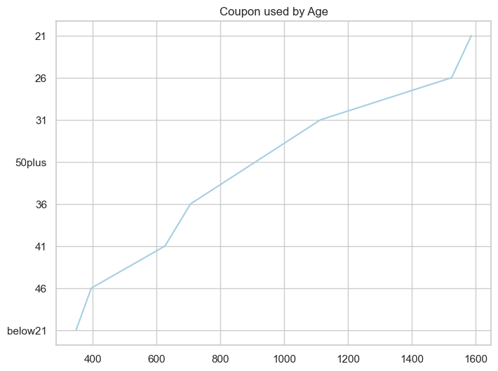
    


```python
plt.figure(figsize = (8,6))

sns.countplot(x='gender',data=vehicle_df,hue='target')
plt.title("Gender Value Counts")
     
```


    Text(0.5, 1.0, 'Gender Value Counts')


    
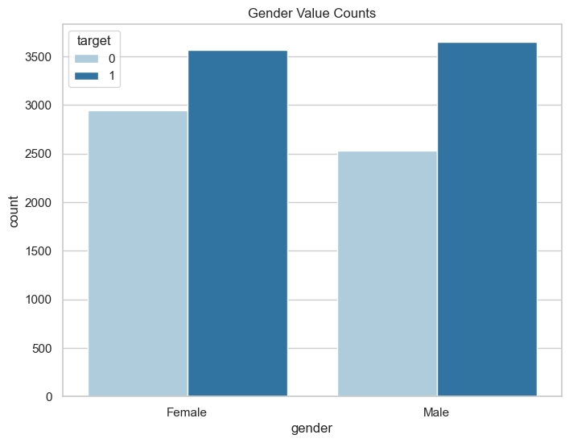
    


```python
plt.figure(figsize = (8,6))

sns.countplot(x='marital_status',data=vehicle_df,hue='target')
plt.title("Marital Status Value Counts")
```


    Text(0.5, 1.0, 'Marital Status Value Counts')


    
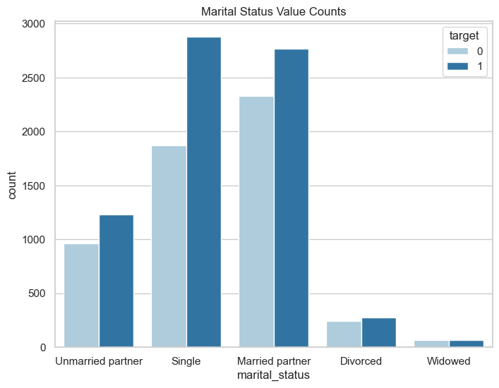
    


```python
import os
print (os.getcwd())
```

    /Users/priti16


```python

```
